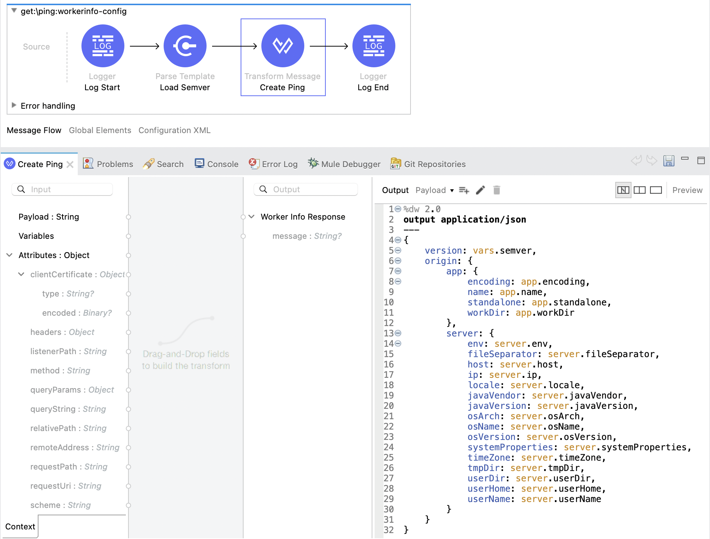

# mule-concourse-pipeline-example

## About
A simple Mule 4 API, used for testing & demonstrating Mule 4 application deployments using [Concourse](https://concourse-ci.org/) pipelines in combination with a generic Mule 4 pipeline resource: [mule-concourse-pipeline](https://github.com/mulesoft-catalyst/mule-concourse-pipeline).

The example pipelines can be used as a **foundation** for (more) **complex** pipeline definitions. 

**Note**: Although the example pipelines assume Runtime Fabric as the target deployment options, a similar approach can be followed for other deployment options like **CloudHub** and **Standalone** Mule runtimes.

## Description

### Specification
The API has a single operation, providing runtime, host & container information: 

#|Key|Value|
---|---|---|
1|**Endpoint**|`host:port/workerinfo`
2|**Method**|GET
3|**Headers**|NA

### Flow Details

**Overview**


**Flow Steps**

1. **Log Start** Step

    Logs the start of the flow using the default Logger component (Core). For testing purposes the complete `#[payload]` is logged on `INFO` level.

2. **Load Semver** Step

    Loads the Semver `version` file (`src/main/resources`) using the Parse Template component. For testing purposes the complete `#[payload]` is logged on `INFO` level.

3. **Create Response** Step

    Creates the API response using the Transformation component, e.g.:
    ```
    {
        "version": "1.0.2",
        "origin": {
            "app": {
                "encoding": "UTF-8",
                "name": "mule4-workerinfo-dev",
                "standalone": true,
                "workDir": "/opt/mule/./.mule/mule4-workerinfo-dev"
            },
            "server": {
                "env": {
                    . . .
                    "ORG_ID": "8cc90329 ... 5db10edc3257",
                    . . .
                    "APP_NAME": "mule4-workerinfo-dev",
                    . . .
                    "ENV_ID": "c02e8cc1 ... 3551dd0e0f75"
                },
                "fileSeparator": "/",
                "host": "mule4-workerinfo-dev-7f4b85fd5-t58sx",
                "ip": "10.244.84.69",
                "locale": {
                    "unicodeLocaleKeys": [],
                    "country": "",
                    "ISO3Language": "eng",
                    "displayName": "English",
                    "language": "en",
                    . . .
                },
                "javaVendor": "Private Build",
                "javaVersion": "1.8.0_265",
                "osArch": "amd64",
                "osName": "Linux",
                "osVersion": "4.18.0-80.11.2.el8_0.x86_64",
                "systemProperties": {
                    "java.vendor": "Private Build",
                    "sun.java.launcher": "SUN_STANDARD",
                    "sun.management.compiler": "HotSpot 64-Bit Tiered Compilers",
                    "os.name": "Linux",
                    . . .
                    "wrapper.port": "34000",
                    "wrapper.arch": "x86"
                },
                "timeZone": "GMT",
                . . .
                "userName": "app"
            }
        }
    }
    ```

4. **Log End** Step

    Logs the end of the flow using the default Logger Component (Core). For testing purposes the complete `#[payload]` is logged on `INFO` level.

### Application Properties

1. **Property Management**

    The application uses  `<configuration-properties>` to load its properties from the `src/main/resources/<env-name>.properties` file. 

    Additional environment specific property files can be added to the `src/main/resources` folder. The `<env-name>` value can be set using the `mule.env` property acting as a 'switch' allowing to load environment specific properties at runtime.

    **Note**: The `<mule.env>` property value defaults to `local` using `<global-property>`.

2. **HTTP Listener**

    The application uses a configurable `port` in the `HTTP Listener` component, e.g.:

    `http.port=8081`

3. **Autodiscovery**

    The application uses a configurable `API Id` and `Environment` credential pair in the global `Autodiscovery` component, e.g.:

    ```
    api.id=16084400
    anypoint.platform.client_id=[CLIENT ID]
    anypoint.platform.client_secret=[CLIENT SECRET]
    ```

### Semver

To support [Semver](https://semver.org/) versioning, a `version` file has been added (`src/main/resources`) that can be used by a Concourse [Semver](https://github.com/concourse/semver-resource) resource to drive the versioning aspects of the Mule application asset.

## Usage

The Maven POM file supports the following properties.

No.|Category|Description|Properties
|---|---|---|---
1|**Platform**|The **Platform** properties can be used to set the platform url and [Connected Apps](https://docs.mulesoft.com/access-management/connected-apps-overview) credentials|1. `anypoint-platform-url`<br>2. `connected-app-client-id`<br>3. `connected-app-client-secret`<br>4. `connected-app-grant-type`
2|**Environment**|The **Environment** properties can be used to set the Environment and Runtime Fabric instance details|1. `environment.name`<br>2. `rtf.instance.name`
3|**Settings**|The **Settings** properties can be used to set any relevant application level settings like environment name and autodiscovery properties|1. `mule-env-name`<br>2. `application-client-id`<br>3. `application-client-secret`
4|**Application**|The **Application** properties can be used to set the Application domain name and resource allocation parameters|1. `application-domain-name`<br>2. `application-cpu-reserved`<br>3. `application-cpu-max`<br>4. `application-mem-reserved`<br>5. `application-mem-max`
5|**Deployment**|The **Deployment** properties can be used to set any relevant deployment settings|1. `deployment-mule-runtime`<br>2. `deployment-replicas`<br>3. `deployment-replicas-across-nodes`<br>4. `deployment-update-strategy`<br>5. `deployment-forward-ssl`<br>6. `deployment-clustered`<br>7. `deployment-last-mile-security`

The following is an overview of the relevant Maven goals:

No.|Operation|Sample Command 
|---|---|---
1|Application `build` and `test`|<pre>`mvn test`</pre>
2|Application asset `publication` to Exchange|<pre>`mvn deploy -DskipTests`</pre>
3|Application asset `deployment` to a Runtime Fabric instance|<pre>`mvn deploy -DmuleDeploy -DskipTests -Dmule.env.name=dev -Danypoint.platform.url=anypoint.mulesoft.com -Dconnected.app.client.id=[CLIENT ID] -Dconnected.app.client.secret=[CLIENT SECRET] -Dconnected.app.grant.type=client_credentials -Denvironment.name=Development -Drtf.instance.name=fabric-instance -Dapplication.domain.name=example.org -Dapplication.cpu.reserved=1000m -Dapplication.cpu.max=1500m -Dapplication.mem.reserved=3500Mi -Dapplication.mem.max=3500Mi -Dapplication.client.id=bdfea201b67c ... 393f65ab097975628 -Dapplication.client.secret=a835230238d4 ... 3961A097ded787fEC -Ddeployment.mule.runtime=4.3.0 -Ddeployment.replicas=1 -Ddeployment.replicas.across.nodes=false -Ddeployment.update.strategy=rolling -Ddeployment.forward.ssl=false -Ddeployment.clustered=false -Ddeployment.last.mile.security=false`</pre>

## Example Pipelines

The following is an overview of the different **Concourse** pipeline examples. All examples `build`, `test`, `package`, `publish` and `deploy` this application using different pipeline approaches:

|No.|Pipeline|Description|Details
|-|-|-|-
|1|[Single Job](pipelines/pipeline-1)|Single job pipeline with 3 separate tasks|Tasks:<br> <li> `Verify`<br><li>`Publish`<br><li>`Deploy`
|2|[Multiple Jobs](pipelines/pipeline-2)|Multiple jobs pipeline|Jobs:<br><li>`Verify`<br><li>`Publish`<br><li>`Deploy`
|3|[Multiple Jobs - Custom Resources](pipelines/pipeline-3)|Multiple jobs pipeline including **custom** Concourse [Resource Types](https://concourse-ci.org/resource-types.html):<br><li>**Anypoint Exchange** - [exchange-concourse-resource](https://github.com/mulesoft-catalyst/exchange-concourse-resource)<br><li>**Anypoint Runtime Fabric** - [rtf-concourse-resource](https://github.com/mulesoft-catalyst/rtf-concourse-resource)|Jobs:<br><li>`Verify` / `Publish`<br><li>`Deploy`